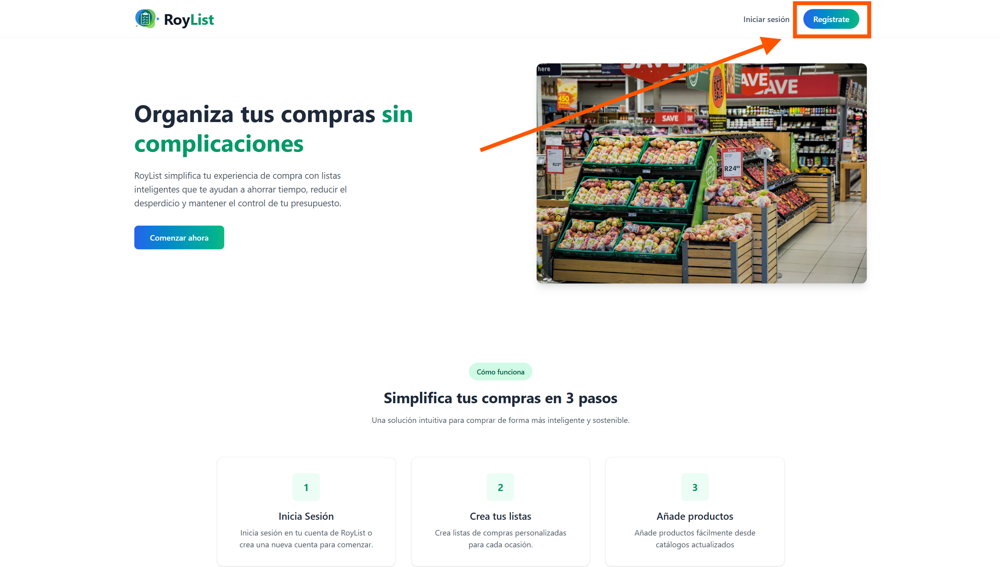
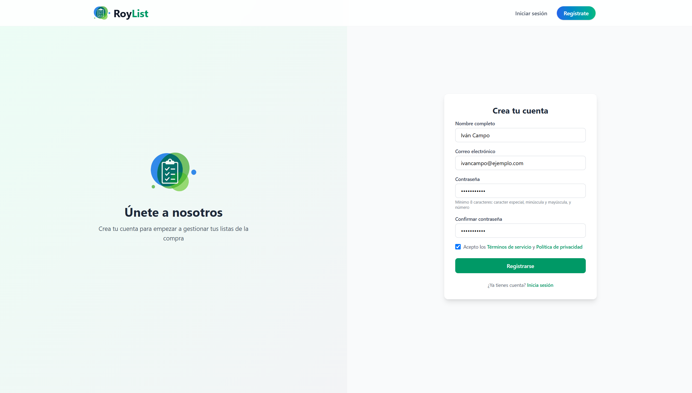
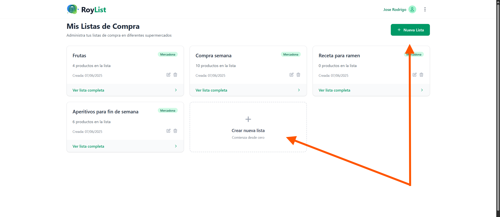
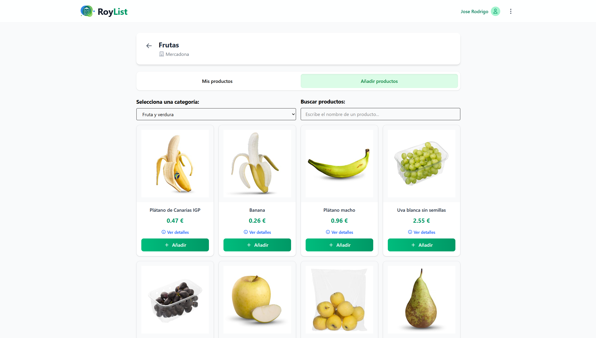
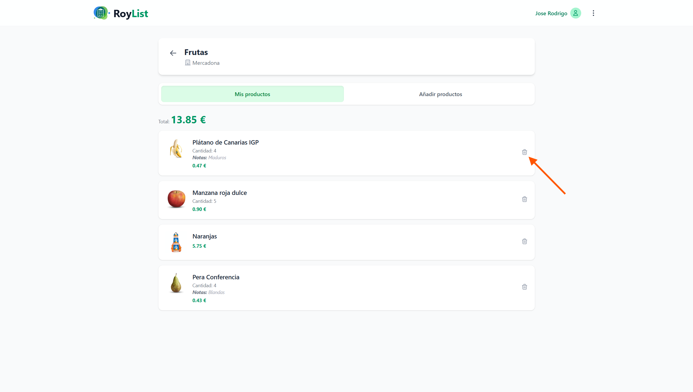

# Manual de Usuario - RoyList

## 1. Introducción

**RoyList** es una aplicación web que permite a los usuarios crear y gestionar listas de la compra. Los usuarios pueden registrarse, iniciar sesión, crear nuevas listas, añadir productos por categoría y eliminar elementos o listas completas. Su interfaz es intuitiva y está diseñada para usarse desde cualquier navegador moderno.

## 2. Requisitos Previos

- Navegador web actualizado (Chrome, Firefox, Edge, Safari)
- Conexión a Internet activa
- Cuenta de usuario registrada y verificada en RoyList

## 3. Registro de Usuario

1. Abra su navegador y acceda a `http://localhost:8000`.
2. Haga clic en **Registrarse** (esquina superior derecha).

3. Rellene los campos del formulario:
   - **Nombre**
   - **Correo electrónico**
   - **Contraseña**
   - **Confirmar contraseña**
4. Haga clic en **Registrarse**.

5. Recibirá un correo de verificación.
6. Pulse el enlace incluido para activar su cuenta.

## 4. Inicio de Sesión

1. Acceda nuevamente a `http://localhost:8000`.
2. Haga clic en **Iniciar sesión**.
3. Introduzca su correo y contraseña.
4. Haga clic en **Iniciar sesión**.

Si los datos son correctos, accederá a su panel con las listas disponibles.

## 5. Operaciones Básicas

### 5.1 Crear una Lista de la Compra

1. Desde el panel principal, haga clic en **Crear nueva lista**.
2. Complete el formulario:
   - **Nombre de la lista** (ej: "Compra semanal")
   - **Supermercado** (seleccione uno, por ejemplo: Mercadona)
3. Haga clic en **Guardar** para crear la lista.

### 5.2 Editar o Borrar una Lista

- **Editar**: haga clic en el icono de lápiz o en **Ver lista completa**.
- **Eliminar**: haga clic en el icono de papelera y confirme la acción.

### 5.3 Añadir un Producto

1. Haga clic en **Ver lista completa**.
2. Pulse el botón **Añadir productos**.
3. Seleccione una **categoría** del desplegable.
4. En el catálogo, pulse **Añadir** en el producto deseado.
5. Introduzca la **cantidad** y una **nota** opcional.
6. Pulse **Guardar**.

### 5.4 Eliminar un Producto

1. En la vista de detalle, ubique el producto.
2. Haga clic en el icono de papelera a su derecha.

### 5.5 Cerrar Sesión

1. En la barra de navegación, haga clic en el icono de tres puntos.
2. Seleccione **Cerrar sesión**.
3. Será redirigido a la página de inicio.

## 6. Descripción de la Interfaz

- **Barra superior**: contiene los enlaces de navegación y acciones de sesión.
- **Listado de listas**: muestra todas las listas creadas, incluyendo su nombre, supermercado, productos y acciones.
- **Botón “Crear nueva lista”**: accede al formulario de creación.
- **Vista de detalle de lista**: muestra productos añadidos, permite eliminarlos y ver el precio total.
- **Pestaña “Añadir producto”**: incluye un selector de categoría, catálogo filtrado, buscador de productos y botón para añadir.

## 7. Resolución de Problemas Comunes

- **No recibo el correo de verificación**: revise las carpetas de spam, social o promociones.
- **Error al crear lista**: verifique que ha escrito un nombre y seleccionado un supermercado.
- **Botones o estilos no funcionan**: recargue la página y revise la consola del navegador.

## 8. Soporte y Contacto

Para incidencias o sugerencias:

- Correo: [contacto@roylist.com](mailto:contacto@roylist.com)
- Repositorio: [Repositorio Oficial](https://github.com/rodriiii94/RoyList)

