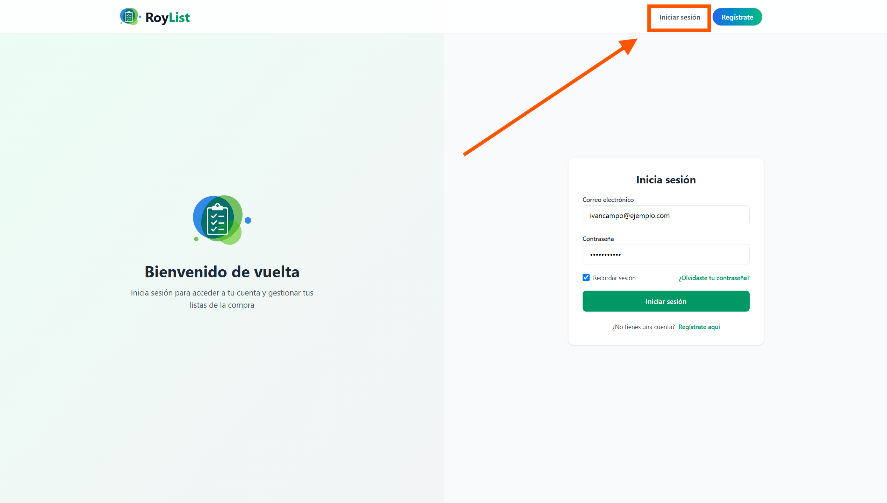
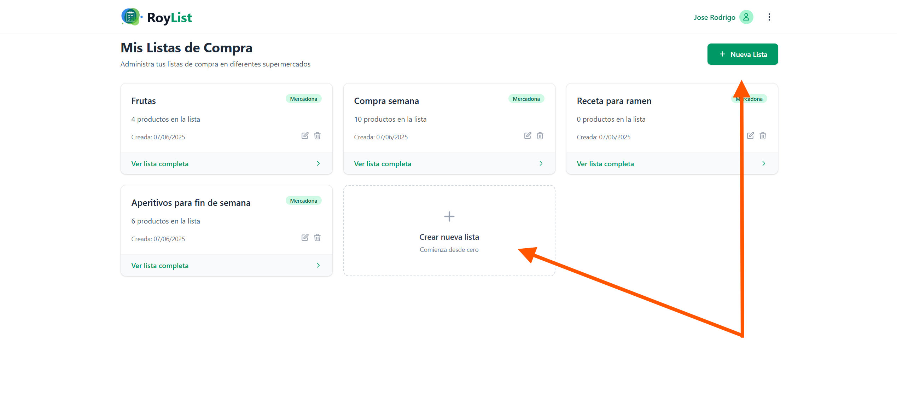

## Manual de Usuario

### 1. Introducción

RoyList es una aplicación web que permite a los usuarios crear y gestionar listas de la compra. Los usuarios pueden registrarse, iniciar sesión, crear nuevas listas, añadir productos a esas listas a partir de categorías predefinidas y eliminar elementos o listas completas. La interfaz está diseñada para ser intuitiva y accesible desde cualquier navegador moderno.

### 2. Requisitos Previos

* Navegador web actualizado (Chrome, Firefox, Edge, Safari).
* Conexión a Internet activa.
* Cuenta de usuario registrada y verificada en RoyList.

### 3. Registro de Usuario

1. Abra el navegador y acceda a `http://localhost:8000`.
2. Haga clic en **Registrarse** en la parte superior derecha. (Si ya tiene una cuenta, puede iniciar sesión directamente, saltando al paso 4).

3. Rellene los siguientes campos:

   * **Nombre**
   * **Correo electrónico**
   * **Contraseña**
   * **Confirmar contraseña**

4. Haga clic en **Registrarse**.

5. Recibirá un correo de verificación en su bandeja de entrada.
6. Pulse el enlace de verificación para activar su cuenta.

### 4. Inicio de Sesión

1. Abra el navegador y vaya a `http://localhost:8000`.
2. Haga clic en **Iniciar sesión** en la parte superior derecha.

3. Introduzca su correo electrónico y contraseña.
4. Haga clic en **Iniciar sesión**.
5. Si los datos son correctos, será redirigido a la página principal con acceso a sus listas de la compra.

### 5. Operaciones Básicas

#### 5.1 Crear una lista de la compra

1. En el listado de listas, haga clic en **Crear nueva lista**.

2. En el formulario:

   * **Nombre de la lista**: p. ej. “Compra semanal”.
   * **Supermercado**: seleccione “Mercadona” (u otras cadenas habilitadas).
3. Pulse **Guardar**.
4. Verá su nueva lista en el listado principal.

#### 5.2 Editar o borrar una lista

* **Editar lista:** en el listado de listas, haga clic en el icono de lápiz junto a la lista o haga clic en **Ver lista completa**.
* **Eliminar lista:** haga clic en el icono de papelera junto a la lista y confirme la acción. La lista y todos sus productos asociados serán borrados.

#### 5.3 Añadir un producto

1. En el listado de listas, haga clic en **Ver lista completa** junto a la lista deseada.
2. Pulse el botón **Añadir productos**.
3. Seleccione una **categoría** del desplegable y confirme.
4. Espere a que se cargue el catálogo y, en la lista de resultados, haga clic en **Añadir** junto al producto elegido.
5. Indique la **cantidad**, añada una nota si lo desea y pulse **Guardar**.
6. El producto aparecerá en el detalle de la lista con su nombre, precio y cantidad.

#### 5.4 Eliminar un producto

1. En la vista de detalle de lista, localice el producto que quiere eliminar.
2. Haga clic en el icono de papelera situado a la derecha del producto.

#### 5.5 Cerrar sesión

1. En la barra de navegación, junto a su nombre hay un icono de 3 puntos, que al pulsarlo se abre un menú donde puede hacer clic en **Cerrar sesión**.
2. Será redirigido a la página de inicio con la sesión cerrada.

### 6. Descripción de la Interfaz

* **Barra de navegación superior**: contiene enlaces a “Mis listas” y “Cerrar sesión”. Si no ha iniciado sesión, verá el enlace de “Iniciar sesión” o “Registrarse”.
* **Listado de listas**: muestra todas las listas creadas por el usuario, indicando nombre, cuando se creó, los productos que tiene y supermercado asociado. Cada lista dispone de botones para ver o eliminar la lista.
* **Botón “Crear nueva lista”**: permite acceder al formulario de creación de listas.
* **Pestaña de detalle de lista**: muestra los productos añadidos con la información de cada producto, la opción de eliminarlos y el precio total de la lista.
* **Pestaña de “Añadir producto”**: despliega un selector de categoría y el catálogo según la categoría seleccionada. Tiene un buscador para encontrar productos específicos y cada producto tiene un botón para añadirlo a la lista y el precio.

### 7. Resolución de Problemas Comunes

* **No recibo el correo de verificación:** compruebe la carpeta de spam, social, o promociones.
* **Error al crear lista:** asegúrese de que el nombre no esté vacío y de que haya seleccionado un supermercado.
* **Problemas de estilo o botones inactivos:** recargue la página y compruebe la consola del navegador para errores JavaScript.

### 8. Soporte y Contacto

Para dudas, incidencias o sugerencias, puede contactar al equipo de desarrollo en **[contacto@roylist.com](mailto:contacto@roylist.com)** o consultar la documentación adicional en el repositorio de GitHub: [Repositorio Oficial](https://github.com/rodriiii94/RoyList)
