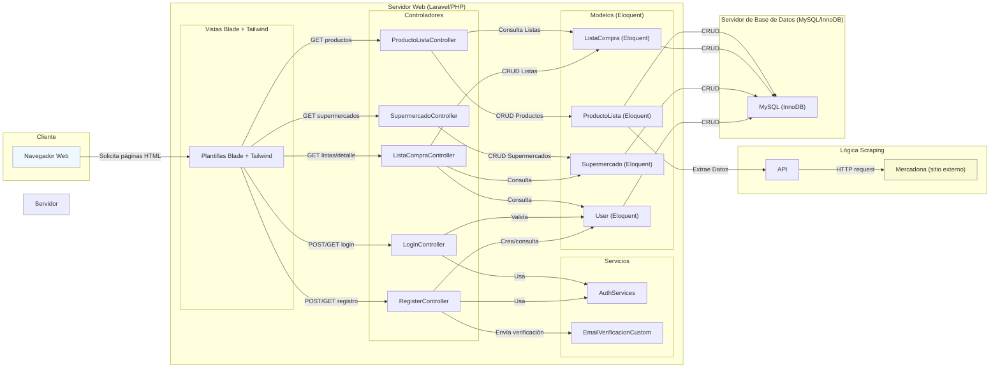

```mermaid
flowchart LR
  %% =========================================
  %% Diagrama de Componentes Mejorado de RoyList
  %% =========================================

  subgraph Cliente
    Navegador["Navegador Web"]
  end

  subgraph "Servidor Web (Laravel/PHP)"
    direction TB

    subgraph Controladores
      RegisterController["RegisterController"]
      LoginController["LoginController"]
      ListaCompraController["ListaCompraController"]
      ProductoListaController["ProductoListaController"]
      SupermercadoController["SupermercadoController"]
    end

    subgraph Servicios
      AuthServices["AuthServices"]
      EmailVerificacionCustom["EmailVerificacionCustom"]
    end

    subgraph "Modelos (Eloquent)"
      UserModel["User (Eloquent)"]
      SupermercadoModel["Supermercado (Eloquent)"]
      ListaCompraModel["ListaCompra (Eloquent)"]
      ProductoListaModel["ProductoLista (Eloquent)"]
    end

    subgraph "Vistas Blade + Tailwind"
      BladeTemplates["Plantillas Blade + Tailwind"]
    end
  end

  subgraph "Lógica Scraping"
    ScrapingLogic["API"]
    MercadonaWeb["Mercadona (sitio externo)"]
  end

  subgraph "Servidor de Base de Datos (MySQL/InnoDB)"
    MySQL["MySQL (InnoDB)"]
  end

  %% =========================================
  %% Flujo Cliente -> Servidor Web
  %% =========================================
  Navegador -->|Solicita páginas HTML| BladeTemplates

  %% =========================================
  %% Vistas -> Controladores
  %% =========================================
  BladeTemplates -->|POST/GET registro| RegisterController
  BladeTemplates -->|POST/GET login| LoginController
  BladeTemplates -->|GET listas/detalle| ListaCompraController
  BladeTemplates -->|GET productos| ProductoListaController
  BladeTemplates -->|GET supermercados| SupermercadoController

  %% =========================================
  %% Controladores -> Servicios (Autenticación y Notificaciones)
  %% =========================================
  RegisterController   -->|Usa| AuthServices
  LoginController      -->|Usa| AuthServices
  RegisterController   -->|Envía verificación| EmailVerificacionCustom

  %% =========================================
  %% Controladores -> Modelos
  %% =========================================
  RegisterController        -->|Crea/consulta| UserModel
  LoginController           -->|Valida| UserModel
  ListaCompraController     -->|CRUD Listas| ListaCompraModel
  ListaCompraController     -->|Consulta| UserModel
  ListaCompraController     -->|Consulta| SupermercadoModel
  ProductoListaController   -->|CRUD Productos| ProductoListaModel
  ProductoListaController   -->|Consulta Listas| ListaCompraModel
  SupermercadoController    -->|CRUD Supermercados| SupermercadoModel

  %% =========================================
  %% Modelos -> Base de Datos
  %% =========================================
  UserModel           -->|CRUD| MySQL
  SupermercadoModel   -->|CRUD| MySQL
  ListaCompraModel    -->|CRUD| MySQL
  ProductoListaModel  -->|CRUD| MySQL

  %% =========================================
  %% Scraping (ProductoListaController -> MercadonaWeb)
  %% =========================================
  ProductoListaModel -->|Extrae Datos| ScrapingLogic
  ScrapingLogic           -->|HTTP request| MercadonaWeb

  %% =========================================
  %% Componentes de Infraestructura
  %% =========================================
  style Navegador fill:#f0f8ff,stroke:#888,stroke-width:1px
  style Servidor Web Laravel/PHP fill:#f5f5dc,stroke:#888,stroke-width:1px
  style Servidor de Base de Datos MySQL/InnoDB fill:#ffe4e1,stroke:#888,stroke-width:1px
  style MercadonaWeb fill:#fafad2,stroke:#888,stroke-width:1px
```
